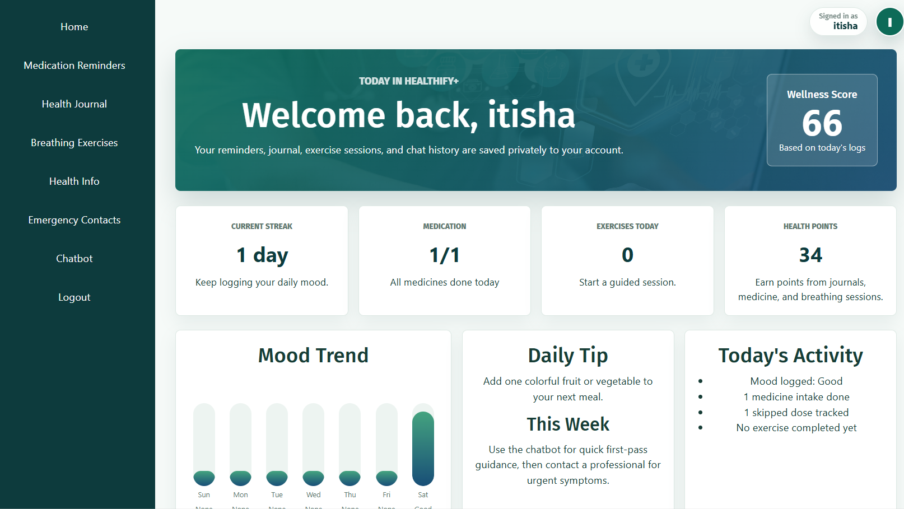
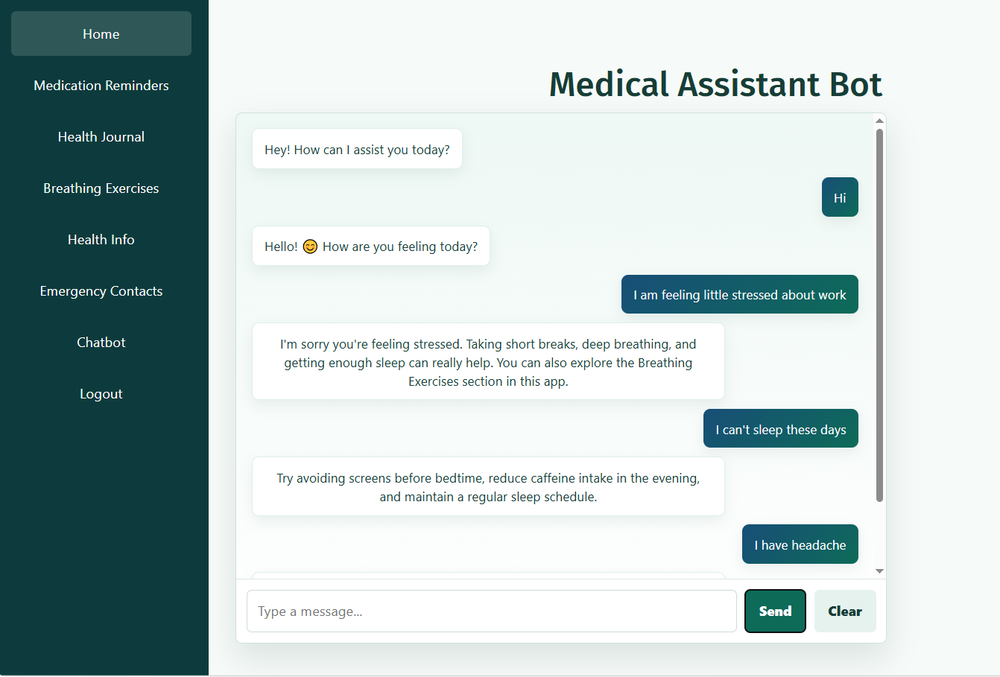

# 🩺 Healthify+

A healthcare web application built using **React.js** and **Firebase** that helps users manage their daily health activities through a personalized dashboard. The application includes secure authentication, a health chatbot with persistent chat history, breathing exercises, reminders, health education, and daily/weekly progress tracking.

---

## ✨ Features

- 🔐 Secure Login & Registration using Firebase Authentication
- 📊 Personalized Dashboard with Daily & Weekly Progress
- 💬 Healthcare Chatbot with Saved Conversation History
- 🫁 Guided Breathing Exercises
- 📚 Health Information & Wellness Tips
- ⏰ Health Reminders
- 📈 Exercise & Activity Tracking
- ☁️ Cloud Data Storage using Firebase Firestore

---

## 🛠️ Tech Stack

| Technology | Purpose |
|------------|---------|
| React.js | Frontend Framework |
| JavaScript (ES6+) | Application Logic |
| Firebase Authentication | User Authentication |
| Firebase Firestore | Database |
| React Router | Navigation |
| Bootstrap 5 | UI Components |
| CSS3 | Styling |

---

## 📂 Project Structure

```
Healthify+
│
├── public/
├── screenshots/
├── src/
│   ├── assets/
│   ├── components/
│   ├── App.js
│   ├── index.js
│   └── ...
│
├── package.json
├── package-lock.json
├── README.md
└── .gitignore
```

---

## 🚀 Getting Started

### 1. Clone the Repository

```bash
git clone https://github.com/Itishanaukudkar11/Healthify.git
```

### 2. Open the Project

```bash
cd Healthify
```

### 3. Install Dependencies

```bash
npm install
```

### 4. Run the Application

```bash
npm start
```

The application will run locally at:

```
http://localhost:3000
```

---

## 📸 Screenshots

### 🏠 Home Page


---

### 🔐 Login Page


---

### 📊 Dashboard



---

### 💬 Healthcare Chatbot



---

## 🔮 Future Improvements

- 🤖 AI-powered healthcare chatbot
- 📅 Appointment booking system
- 💊 Medicine reminder notifications
- 📱 Improved mobile responsiveness
- 📊 Advanced health analytics

---

## 🎯 Learning Outcomes

Through this project, I gained hands-on experience with:

- React Hooks (`useState`, `useEffect`, `useMemo`, `useRef`)
- Component-based architecture
- Client-side routing with React Router
- Firebase Authentication
- Firestore CRUD operations
- State management
- Persistent user data
- Responsive UI development

---

## 👩‍💻 Author

**Itisha Rajendra Naukudkar**

Final Year Major Project built using React.js and Firebase.